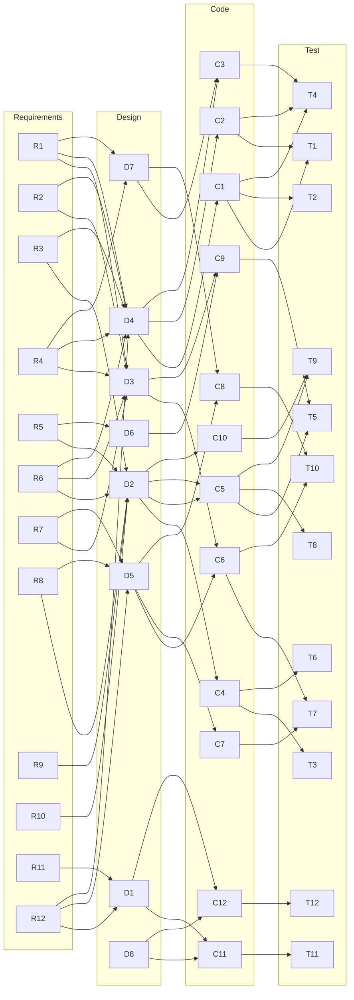
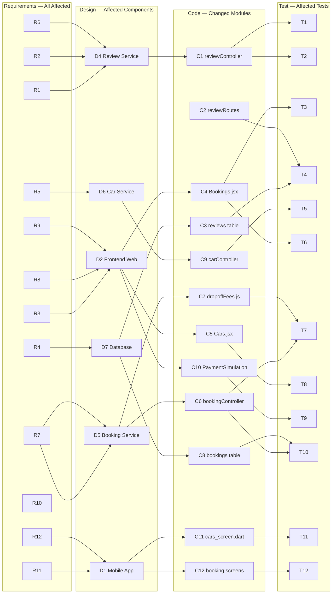
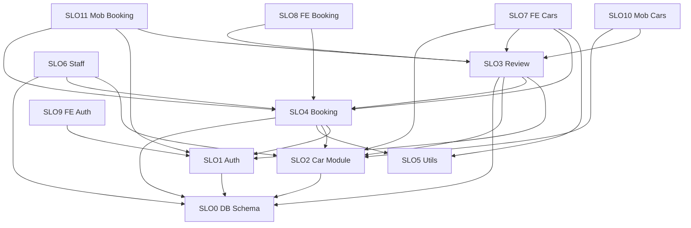

# D4: Impact Analysis
## JianCha — Travel Naja Car Rental Reservation System

### Three New Features
1. **Mobile Client App** — Native Android/Flutter app mirroring the web platform
2. **Feature 1: Car Review System** — Users can rate and review cars after completing a rental
3. **Feature 2: One-way Rental / Different Drop-off Location** — Users can specify a different drop-off city with a variable fee

---

## Section 1: Node Legend

### Requirements (R)

| ID  | Requirement Description |
|-----|------------------------|
| R1  | Users can submit a car review only after a completed rental (status = 'completed') |
| R2  | Review rating must be restricted to 1–5 stars |
| R3  | Review submission UI with star rating and text comment |
| R4  | Reviews stored in DB and linked to a specific car and booking |
| R5  | Car listing displays average rating and review count |
| R6  | Review comment text limited to 500 characters |
| R7  | Drop-off fee correctly calculated based on pick-up/drop-off city pair |
| R8  | User can select a different pick-up and drop-off location |
| R9  | Drop-off fee displayed clearly before booking confirmation |
| R10 | Drop-off location limited to valid supported cities (dropdown only) |
| R11 | Mobile app displays available cars with filtering and search |
| R12 | Mobile app supports full booking flow (select dates, pay, return, review) |

### Design (D) — C4 Containers / Components

| ID  | Design Component |
|-----|-----------------|
| D1  | Mobile App Container (Flutter/Android) |
| D2  | Frontend Web App Container (React/Vite SPA) |
| D3  | Backend REST API Container (Node.js/Express) |
| D4  | Review Service Component (reviewController + reviewRoutes) |
| D5  | Booking Service Component (bookingController + bookingRoutes) |
| D6  | Car Service Component (carController + carRoutes) |
| D7  | Database Container (MySQL — schema, tables) |
| D8  | Auth Service Component (authController + authMiddleware) |

### Code (C) — Modules / Packages

| ID  | Code Module | File(s) |
|-----|------------|---------|
| C1  | Review Controller | `reviewController.js` |
| C2  | Review Routes | `reviewRoutes.js` |
| C3  | Reviews DB Table | `schema.sql` (reviews table) |
| C4  | Bookings Page (Web) | `Bookings.jsx` |
| C5  | Cars Browser (Web) | `Cars.jsx` |
| C6  | Booking Controller | `bookingController.js` |
| C7  | Drop-off Fee Utility | `dropoffFees.js` |
| C8  | Bookings DB Table | `schema.sql` (bookings table — new cols) |
| C9  | Car Controller | `carController.js` |
| C10 | Payment Simulation (Web) | `PaymentSimulation.jsx` |
| C11 | Mobile Cars Screen | `cars_screen.dart` |
| C12 | Mobile Booking / Payment | `booking_form_screen.dart`, `payment_simulation_screen.dart`, `my_bookings_screen.dart` |

### Test (T) — Test Cases

| ID  | Test Case |
|-----|----------|
| T1  | Verify review submission blocked unless booking status = 'completed' |
| T2  | Verify rating < 1 or > 5 is rejected by backend and UI |
| T3  | Verify review form appears in Bookings page for completed bookings |
| T4  | Verify review inserted in DB with correct car_id, booking_id, user_id |
| T5  | Verify avg_rating and review_count computed and displayed per car |
| T6  | Verify 500-char comment limit enforced on frontend and backend |
| T7  | Verify drop-off fee matrix returns correct amount per city pair |
| T8  | Verify drop-off location dropdown shows valid cities only |
| T9  | Verify fee preview shown in booking form and payment page |
| T10 | Verify same-location drop-off returns fee = 0 |
| T11 | Verify mobile car listing loads, filters by type/location |
| T12 | Verify mobile booking creates pending booking and navigates to payment |

---

## Section 2: Full Traceability Graph (Requirements → Design → Code → Test)

---

## Section 3: Change-Affected Traceability Graph (Affected Nodes Only)

> Only nodes directly touched or impacted by the three new features are shown.

---

## Section 4: SLO Directed Graph (Code Module Dependencies)

Each code module is a **Software Lifecycle Object (SLO)**. Arrows show dependency direction (A → B means A depends on / calls B).

| ID    | SLO Name | File(s) |
|-------|----------|---------|
| SLO0  | Database Schema | `schema.sql` |
| SLO1  | Auth Module | `authController.js` + `authMiddleware.js` |
| SLO2  | Car Module | `carController.js` + `carRoutes.js` |
| SLO3  | Review Module | `reviewController.js` + `reviewRoutes.js` |
| SLO4  | Booking Module | `bookingController.js` + `bookingRoutes.js` |
| SLO5  | Utility Modules | `dropoffFees.js` + `pricing.js` + `bookingHelpers.js` |
| SLO6  | Staff Module | `staffController.js` + `staffRoutes.js` |
| SLO7  | Frontend Car Browser | `Cars.jsx` |
| SLO8  | Frontend Bookings and Payment | `Bookings.jsx` + `PaymentSimulation.jsx` |
| SLO9  | Frontend Auth Pages | `Login.jsx` + `Register.jsx` |
| SLO10 | Mobile Car Screens | `cars_screen.dart` + `home_screen.dart` |
| SLO11 | Mobile Booking Screens | `booking_form_screen.dart` + `my_bookings_screen.dart` + `payment_simulation_screen.dart` |

---

## Section 5: SLO Impact Matrix

> **Scale:** 1 = Low impact, 2 = Medium impact, 3 = High impact, — = self
> Row = changed SLO, Column = affected SLO.

|           | SLO0 | SLO1 | SLO2 | SLO3 | SLO4 | SLO5 | SLO6 | SLO7 | SLO8 | SLO9 | SLO10 | SLO11 |
|-----------|------|------|------|------|------|------|------|------|------|------|-------|-------|
| **SLO0**  | —    | 2    | 3    | 3    | 3    | 1    | 2    | 2    | 2    | 1    | 2     | 2     |
| **SLO1**  | 1    | —    | 1    | 2    | 2    | 1    | 1    | 1    | 1    | 3    | 2     | 2     |
| **SLO2**  | 2    | 1    | —    | 3    | 2    | 1    | 2    | 3    | 1    | 1    | 3     | 1     |
| **SLO3**  | 2    | 1    | 2    | —    | 1    | 1    | 1    | 3    | 3    | 1    | 2     | 2     |
| **SLO4**  | 3    | 1    | 2    | 2    | —    | 3    | 2    | 2    | 3    | 1    | 2     | 3     |
| **SLO5**  | 1    | 1    | 2    | 1    | 3    | —    | 1    | 2    | 2    | 1    | 2     | 2     |
| **SLO6**  | 2    | 1    | 2    | 1    | 2    | 1    | —    | 1    | 1    | 1    | 1     | 1     |
| **SLO7**  | 1    | 1    | 2    | 2    | 2    | 2    | 1    | —    | 2    | 1    | 1     | 1     |
| **SLO8**  | 1    | 1    | 1    | 3    | 3    | 1    | 1    | 2    | —    | 1    | 1     | 1     |
| **SLO9**  | 1    | 3    | 1    | 1    | 1    | 1    | 1    | 1    | 1    | —    | 1     | 1     |
| **SLO10** | 1    | 2    | 3    | 2    | 2    | 2    | 1    | 1    | 1    | 1    | —     | 2     |
| **SLO11** | 1    | 2    | 2    | 2    | 3    | 2    | 1    | 1    | 1    | 1    | 2     | —     |

> **Key observations:**
> - **SLO0 (Database Schema)** is the highest-risk change — it propagates at medium-to-high severity to all 11 SLOs.
> - **SLO4 (Booking Module)** has the widest footprint: high impact on SLO5 (utilities), SLO8 (payment frontend), and SLO11 (mobile booking).
> - **SLO3 (Review Module)** tightly couples SLO7 and SLO8 — any review API change breaks both frontend pages.
> - **SLO9 (Frontend Auth)** has the narrowest ripple — changes rarely affect more than SLO1.

---

## Section 6: Easy vs. Difficult Change Requests

### Easy Change Requests

| CR   | Reason |
|------|--------|
| **CR2** — Rating 1–5 validation | Single-point fix: one guard in `reviewController.js` and one UI-level constraint (star picker renders only 1–5). No schema change. Zero cross-module ripple. Affects SLO3 only. |
| **CR6** — 500-character limit | Added `maxLength={500}` to the textarea and one `if (comment.length > 500)` check in the backend. No DB impact. Affects SLO3 and SLO8 at low coupling. |
| **CR10** — Show drop-off fee before confirmation | Pure UI enhancement. Fee is already computed server-side and returned in the API response. Only required displaying the value in `Cars.jsx` and forwarding it in route state to `PaymentSimulation.jsx`. Affects SLO7 and SLO8 only. |
| **CR11** — Dropdown for valid drop-off locations | Replaced a free-text input with a `<select>` in `Cars.jsx`. No backend changes. Prevents invalid data at the source without touching any other module. Self-contained in SLO7. |

**Why easy:** These CRs all affect a single SLO or a pair of closely coupled SLOs. They require no DB migrations, no new routes, and no changes to the API contract. They are also fully verifiable with a single unit or UI test.

---

### Difficult Change Requests

| CR   | Reason |
|------|--------|
| **CR1** — Status validation for review submission | Required adding `'completed'` to the bookings ENUM in `schema.sql`, creating a `returnBooking` endpoint, updating `bookingController.js` and `bookingHelpers.js`, adding a "Return Car" button in `Bookings.jsx`, and replicating the return flow in `my_bookings_screen.dart`. Spans SLO0, SLO4, SLO5, SLO8, and SLO11. |
| **CR3 + CR4** — Review UI and DB storage | Required a new `reviews` table, a new controller, new routes, a review modal in the frontend, and a `LEFT JOIN` on `reviews` in the bookings query to attach `has_review`. Also required updating `carController.js` to compute `avg_rating` and `review_count`. Spans SLO0, SLO2, SLO3, SLO4, SLO7, and SLO8. |
| **CR7** — Correct drop-off fee calculation | Required a variable fee matrix (`dropoffFees.js`), three new columns in the `bookings` table (`pickup_location`, `dropoff_location`, `dropoff_fee`), updates to `bookingController.js`, logic in `bookingHelpers.js` to update the car's location on return, and propagating fee data through the payment screen and mobile booking form. Spans SLO0, SLO4, SLO5, SLO8, and SLO11. |
| **CR9** — Full adaptive one-way booking flow | End-to-end pipeline change: location picker UI in `Cars.jsx`, modified API body contract, DB extension, fee utility, payment page update, and full port to mobile. The most cross-cutting CR — touches SLO0, SLO4, SLO5, SLO7, SLO8, SLO10, and SLO11. |
| **R11 + R12** — Mobile Client App | Entire new platform (Flutter/Dart) built from scratch: API service, auth provider, car listing screen, booking form screen, payment simulation screen, my bookings screen, and staff dashboard. Must stay in sync with any future backend API changes across all SLOs. |

**Why difficult:** These changes span 4–7 SLOs simultaneously, require coordinated DB schema migrations, modify the shared API contract between backend and multiple clients, and must be replicated on the mobile platform.

---

## Section 7: What to Expect from Previous Developers

To make future maintenance easier, we would expect the following from previous developers:

1. **Incremental database migration scripts** — Instead of a monolithic `schema.sql` that drops and recreates all tables, migration files (e.g., `V2__add_reviews_table.sql`, `V3__add_dropoff_columns.sql`) would allow schema evolution without destroying existing data and would make rollback possible.

2. **API versioning** — When the booking endpoint contract changes (e.g., adding `dropoff_location` and `dropoff_fee` fields), a versioned API (`/api/v2/bookings`) would allow old web and mobile clients to remain functional during transition rather than breaking simultaneously.

3. **Shared API contract documentation (OpenAPI/Swagger)** — A machine-readable API spec shared between backend and all frontend clients would have prevented type mismatches, made field additions explicit, and auto-generated type stubs for the Flutter mobile app.

4. **Test coverage for new features from day one** — The existing test suite (`auth.test.js`, `booking.test.js`, `car.test.js`, `staff.test.js`) has no review tests or drop-off fee tests. New features required writing these from scratch. A test-alongside approach would reduce regression risk when the booking or review logic evolves.

5. **Modular utility extraction planned early** — The pricing and drop-off logic was added reactively as utilities. Had `bookingController.js` been designed with a fee-strategy abstraction from the start, adding new fee types (insurance, fuel surcharge) would be a configuration change rather than a code refactor.

6. **Mobile-backend integration guide** — Since the mobile client was added in a later phase, a clear API changelog or integration guide for the Flutter team would have reduced effort spent reverse-engineering which endpoints existed, what authentication headers were required, and how response shapes were structured — especially for edge cases like the `has_review` flag in the bookings list response.
